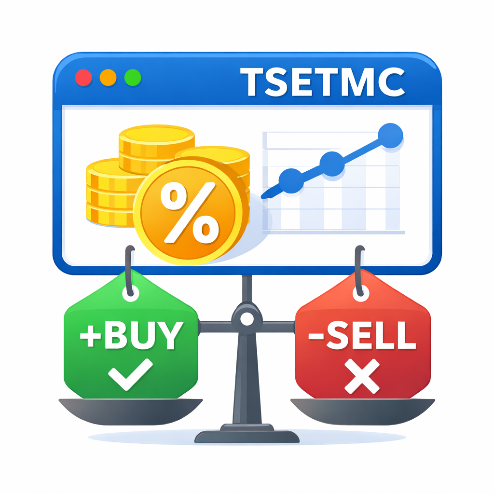

# 📊 ابزار بررسی ارزش خرید و فروش سهام در TSETMC

این ابزار یک افزونه سبک و کاربردی است که به شما کمک می‌کند با **محاسبه خودکار مارجین اختلاف قیمت**، بررسی کنید آیا یک **سهام یا صندوق سرمایه‌گذاری** در شرایط فعلی **ارزش خرید دارد، ارزش فروش دارد یا در وضعیت خنثی قرار دارد**.

این ابزار برای تحلیل داده‌های موجود در سایت **TSETMC (tsetmc.com)** طراحی شده است.

---

## 🎯 هدف ابزار
هدف اصلی این ابزار، ساده‌سازی تصمیم‌گیری سرمایه‌گذار با استفاده از **مقایسه قیمت واقعی دارایی (NAV)** با قیمت‌های خرید و فروش است تا بتوان با دیدی منطقی‌تر، وضعیت بازار را ارزیابی کرد.

---

## 🧠 منطق تحلیل
ابزار با استفاده از قیمت‌های زیر تحلیل را انجام می‌دهد:

- قیمت آماری (NAV)
- قیمت صدور (خرید)
- قیمت ابطال (فروش)

سپس اختلاف این قیمت‌ها را نسبت به NAV محاسبه کرده و با توجه به **تلورانس درصدی مشخص‌شده توسط کاربر**، نتیجه را مشخص می‌کند:

- ✅ مناسب خرید
- 🔴 مناسب فروش
- ⚖️ خنثی (عدم برتری خرید یا فروش)

---

## ⚙️ ویژگی‌ها
- تحلیل مبتنی بر مارجین اختلاف قیمت
- تمرکز بر ارزش واقعی دارایی به‌جای هیجان بازار
- مناسب برای صندوق‌های سرمایه‌گذاری (به‌ویژه صندوق‌های طلا)
- رابط ساده و سریع
- امکان تنظیم تلورانس دلخواه برای استراتژی‌های مختلف

---

## ⚠️ نکته مهم
این ابزار **سیگنال قطعی خرید یا فروش** ارائه نمی‌دهد و صرفاً یک ابزار تحلیلی کمکی است.
مسئولیت تصمیم‌گیری نهایی در سرمایه‌گذاری به عهده کاربر است.

---

## 📌 موارد استفاده
- بررسی وجود حباب مثبت یا منفی
- مقایسه قیمت بازار با ارزش واقعی
- کمک به تصمیم‌گیری در خرید پله‌ای یا فروش منطقی
- استفاده روزانه توسط سرمایه‌گذاران و معامله‌گران

## ⚖️ سلب مسئولیت (Disclaimer)

این ابزار صرفاً یک **ابزار کمکی تحلیلی** است و اطلاعات ارائه‌شده توسط آن به‌هیچ‌وجه **توصیه مالی، سرمایه‌گذاری یا معاملاتی** محسوب نمی‌شود.

تمام محاسبات انجام‌شده بر اساس داده‌های موجود در صفحه و فرمول‌های ساده اختلاف قیمت (Margin / Premium) بوده و **دقت، صحت یا به‌روز بودن داده‌ها تضمین نمی‌شود**.

استفاده از این ابزار به‌معنای پذیرش کامل این موضوع است که:
- تصمیمات خرید، فروش یا نگهداری دارایی‌ها **صرفاً بر عهده کاربر** است
- توسعه‌دهنده این ابزار **هیچ‌گونه مسئولیتی** در قبال سود، زیان، تصمیمات نادرست یا پیامدهای مالی احتمالی ندارد
- شرایط بازار، نقدشوندگی، کارمزدها، مالیات و ریسک‌های سیستماتیک در این ابزار لحاظ نشده‌اند

پیشنهاد می‌شود پیش از هرگونه تصمیم سرمایه‌گذاری، از **تحلیل‌های تکمیلی** و در صورت نیاز از **مشاوره متخصصان مالی** استفاده شود.

---------

# 📊 TSETMC Buy & Sell Value Checker Tool

This tool is a lightweight and practical extension designed to help investors **automatically calculate price margin differences** and determine whether a **stock or investment fund** is currently **worth buying, worth selling, or neutral**.

It is built specifically to analyze data available on **TSETMC (tsetmc.com)**.

---

## 🎯 Purpose
The main goal of this tool is to simplify investment decisions by **comparing the real asset value (NAV)** against buy and sell prices, allowing for a more rational and data-driven market evaluation.

---

## 🧠 Analysis Logic
The tool analyzes the following prices:

- Net Asset Value (NAV)
- Buy price (Subscription)
- Sell price (Redemption)

It then calculates the percentage difference relative to NAV and, based on a **user-defined tolerance percentage**, classifies the situation as:

- ✅ Suitable for buying
- 🔴 Suitable for selling
- ⚖️ Neutral (no clear advantage)

---

## ⚙️ Features
- Margin-based price analysis
- Focus on intrinsic value rather than market hype
- Especially useful for investment funds (notably gold funds)
- Simple and fast user interface
- Customizable tolerance for different investment strategies

---

## ⚠️ Important Notice
This tool does **not provide guaranteed buy or sell signals**.
It is intended as a **decision-support tool**, and all investment decisions remain the responsibility of the user.

---

## 📌 Use Cases
- Detecting positive or negative price premiums
- Comparing market price versus intrinsic value
- Supporting logical buy or sell decisions
- Daily use by investors and traders

## ⚖️ Disclaimer

This tool is provided solely as an **analytical support utility** and does **not constitute financial, investment, or trading advice**.

All calculations are based on publicly available page data and simple margin/premium formulas. **No guarantee is given regarding the accuracy, completeness, or timeliness of the data or results**.

By using this tool, you acknowledge and agree that:
- All buy, sell, or hold decisions are made **entirely at your own risk**
- The developer assumes **no responsibility or liability** for any financial losses, missed opportunities, or incorrect decisions
- Market conditions, liquidity, fees, taxes, and systemic risks are **not accounted for** by this tool

It is strongly recommended to perform **additional analysis** and, when appropriate, consult with **qualified financial professionals** before making any investment decisions.

